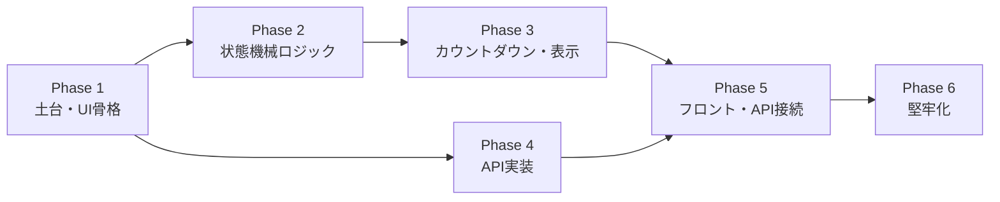

# Pomodoro Timer 段階的実装計画

設計原則として、フェーズが進むごとに「壊せる範囲が増えない」構造にする。
初期フェーズで抽象化の骨格を置き、後から肉付けする順序で進める。

---

## Phase 1 — 土台構築（1日目）

**目的:** 画面が出て静的UIが見える状態にする

1. Flaskエントリポイントと最小ルーティング
   - `GET /` でHTMLを返す
   - `static/`, `templates/` のディレクトリ構成を整備
2. HTMLのスケルトン作成
   - タイトル、モード表示、タイマー文字、ボタン2つ、進捗カードの骨格のみ
3. CSSのスタイル作成
   - モックの配色・フォント・丸み・余白を反映
   - 円形プログレスリングをSVGまたはconic-gradientで配置（固定値でよい）
4. Flaskの起動確認

**完了の定義:** ブラウザでモックに近い静的な画面が表示される

---

## Phase 2 — タイマーロジックの骨格（2日目前半）

**目的:** UIに触れる前にコアロジックを確立し、テストを最初から通せる状態にする

1. `config.js` — 設定オブジェクト
   - 作業25分・短休憩5分・長休憩15分・セッション数4を注入可能な形で定義
2. `clock.js` — Clock抽象
   - `SystemClock`（本番）と `FakeClock`（テスト用、時刻を手動で進められる）
3. `state_machine.js` — 状態遷移純粋関数
   - `nextState(state, event, context)` として副作用なしで実装
   - 状態: idle / work / short_break / long_break / paused
   - イベント: START / RESET / COMPLETE
   - 長休憩ルール（4セッションごと）を含む
4. JSユニットテストの初回実行
   - 状態遷移テーブルテスト
   - 長休憩切り替えテスト

**完了の定義:** `state_machine.js` の主要遷移テストがすべて通る

---

## Phase 3 — カウントダウンと表示接続（2日目後半〜3日目前半）

**目的:** 実際にタイマーが動いて見えるようにする

1. `scheduler.js` — Scheduler抽象
   - `IntervalScheduler`（本番）と `ManualScheduler`（テスト用、手動tick）
2. カウントダウン実装
   - `endAt = now + duration` で開始
   - `remaining = max(0, endAt - now)` を毎tickで計算
3. `presenter.js` — Presenter
   - `render(viewModel)` で残り時間文字列・プログレスリング・モード表示・ボタン状態をまとめて更新
4. `app.js` — イベント接続
   - 開始・リセットボタンを状態機械に接続
   - Presenterを通してDOMを更新
5. 0秒到達時の完了イベントを一度だけ発火する仕組み

**完了の定義:** 開始でカウントダウンが動き、0秒でモードが遷移し、リセットで戻る

---

## Phase 4 — API実装と記録（3日目後半〜4日目前半）

**目的:** データを残せるようにし、進捗カードが実データで動く

1. `models.py` — セッションモデル定義
2. `session_repository.py` — Repositoryインターフェース
   - `SqliteSessionRepository`（本番）と `InMemorySessionRepository`（テスト用）
3. `POST /api/sessions` — セッション完了記録
   - 入力バリデーション（必須項目・型）
   - 重複保存防止
4. `GET /api/stats/today` — 当日集計
   - 完了件数・集中時間を返す
5. Flask APIテスト
   - 正常・異常・境界値

**完了の定義:** APIテストが通り、`curl` でセッション保存と集計取得ができる

---

## Phase 5 — フロントとAPIの接続（4日目後半）

**目的:** 画面とサーバーが繋がり、進捗カードが実データで動く

1. セッション完了時に `POST /api/sessions` を呼ぶ
2. 初期表示と完了後に `GET /api/stats/today` を呼んで進捗カードを更新
3. API失敗時のフォールバック表示（表示値を変えない・エラー表示）

**完了の定義:** 作業完了 → 件数と集中時間が画面上で更新される

---

## Phase 6 — 堅牢化（5日目）

**目的:** 実運用で壊れない品質を担保する

1. リロード復元
   - 開始時刻・状態・セッション数を `localStorage` に保存
   - 再読み込み後に `endAt` から残時間を復元
2. タブ復帰・スリープ復帰の整合確認
   - 非アクティブ後も `endAt - now` で正しい残時間になる
3. 重複完了防止の確認
   - `completed` フラグで二重発火抑制
4. モバイル表示最適化
   - 余白・文字サイズ・ボタン領域の調整
5. 最小E2Eチェック（手動）
   - 開始 → 完了 → 休憩 → 作業の通し確認
   - リロード復元確認

**完了の定義:** E2Eチェックリストが完了し、モバイルで操作性を満たす

---

## フェーズ依存関係

Phase 2（ロジック）とPhase 4（API）はPhase 1完了後に並行して進めることができる。

---

## フェーズとチケットの対応

| フェーズ | 対応チケット |
|---|---|
| Phase 1 | PMD-001, PMD-002 |
| Phase 2 | PMD-003, PMD-009 |
| Phase 3 | PMD-004, PMD-005 |
| Phase 4 | PMD-006, PMD-007, PMD-010 |
| Phase 5 | PMD-008 |
| Phase 6 | PMD-011, PMD-012 |
